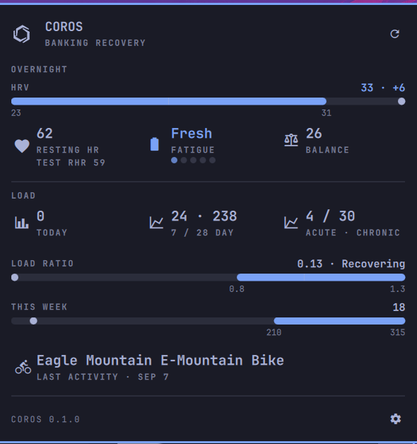

# Omarchy-coros

COROS recovery metrics on the Omarchy bar. Sign in to your COROS Training
Hub account from the panel — nothing is hosted. The bar shows one compact
metric; the panel shows overnight HRV vs band, resting HR, fatigue, training
load, and the last activity.



This plugin talks to the **unofficial** COROS Training Hub REST API
(`teamapi` / `teameuapi`). It is not affiliated with COROS. Plugins run
unsandboxed inside `omarchy-shell`.

## Install

```sh
omarchy plugin add https://github.com/astorrer/omarchy-coros.git --enable
```

The widget lands on the right of the bar. Click it and sign in with your
Training Hub email, password, and region (US or EU). Credentials are written
to `~/.config/omarchy-coros/credentials` (mode 0600) only after a successful
login — never on argv, never in widget settings, never in git. The password
stays in that file so a 24h token refresh can log in again; it is MD5-hashed
for the login call. The access token is cached separately at
`~/.cache/omarchy-coros/token.json` (mode 0600).

`python3` is required (stdlib only, no pip). It is already on every Omarchy
install.

## Usage

Click the bar widget to open or close the panel. Escape closes it (or goes
Back from settings). Tab / Shift+Tab switches to the next bar panel.

- The bar shows one metric (`HRV 24` by default), the COROS mark, or
  fatigue. Hover for a tooltip.
- Overnight: HRV vs the Training Hub band, resting HR, fatigue, balance.
- Load: today, 7/28-day, acute/chronic, load ratio, weekly target.
- Last activity marquees if the name is longer than the row.

If logins fail on both regions, polls back off for an hour. Network errors
show in the panel instead of looking like empty metrics.

## Configure

```sh
omarchy bar move io.github.astorrer.omarchy-coros --section right
```

Open settings from the gear in the panel, or Omarchy Settings → Bar → COROS:

| Key                  | Type    | Default | Meaning                                      |
|----------------------|---------|---------|----------------------------------------------|
| `refreshIntervalMin` | integer | 30      | Snapshot poll interval (15 min–24 h)         |
| `region`             | string  | `"eu"`  | Training Hub region, `eu` or `us`            |
| `hideWhenNoData`     | boolean | false   | Hide the widget from the bar when empty      |
| `showRecovery`       | boolean | true    | Panel: HRV, RHR, balance, fatigue            |
| `showLoad`           | boolean | true    | Panel: daily and rolling training load       |
| `showActivity`       | boolean | true    | Panel: last workout                          |
| `barMetric`          | string  | `"hrv"` | Bar: `icon`, `hrv`, `rhr`, `load`, `fatigue` |

## Remove

```sh
omarchy plugin remove io.github.astorrer.omarchy-coros
```

That removes the plugin checkout. To also drop credentials and the token
cache this plugin wrote:

```sh
~/.config/omarchy/plugins/io.github.astorrer.omarchy-coros/setup.sh uninstall
```

Or use **Sign out** in the panel settings before removing the plugin.

## Troubleshooting

- **Sign-in failed** — pick **us** if the account is on America Training Hub
  (`t.coros.com`), **eu** for Europe (`t.eu.coros.com`). A wrong region is
  retried once; a successful login follows COROS `regionId`. This is
  email/password against Training Hub, not 2FA.
- **Can't reach Training Hub** — network or a bad API body. The widget stays
  visible and retries on the next poll.
- **HRV / resting HR blank after sign-in** — Training Hub often leaves *today*
  empty until overnight HRV lands. The widget walks the last week and shows
  the newest day that has recovery metrics.
- **Sleep missing** — expected. Training Hub `dayDetail` has no sleep duration
  (`tib` is training impact balance). Sleep is mobile-API only and is not
  called here.

## Development

```sh
ruff check .
./tests/run
```

`./tests/run` lints, validates `manifest.json`, runs the Python tests (mocked
HTTP, no network), `omarchy plugin validate`, and `qmllint`.

To list this plugin on the [Omarchy marketplace](https://plugins.omarchy.org/publish.html),
open the [submit form](https://github.com/omacom/omarchy-plugin-marketplace/issues/new?template=submit-plugin.yml)
with the public repo URL. Listing is not a security review.

## License

MIT. See [LICENSE](LICENSE).
